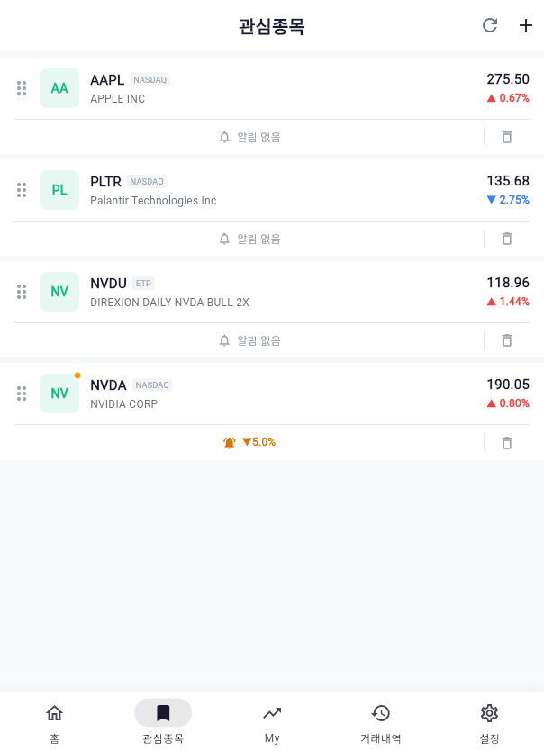
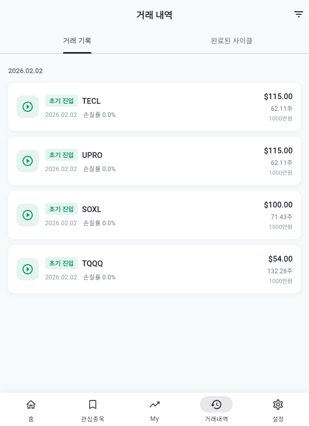
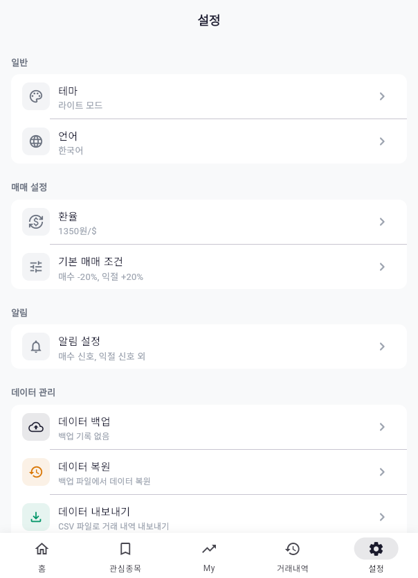

# Alpha Cycle

레버리지 ETF 가중 매수 매매법을 기반으로 한 미국 주식 관리 앱

## 스크린샷

| 홈 | 관심종목 | My (종목관리) |
|:---:|:---:|:---:|
|  |  |  |

| 거래내역 | 설정 | 상세 페이지 |
|:---:|:---:|:---:|
|  |  |  |

## 주요 기능

- **알파 사이클 매매법** — 가중 매수, 승부수, 익절 자동 계산
- **실시간 시세** — Finnhub WebSocket + REST API
- **캔들스틱 차트** — 일봉/주봉/월봉, 줌/스크롤, 이동평균선 (5/20/60/120일)
- **보조지표 7종** — VOL, BB, RSI, MACD, Stochastic, 일목균형표, OBV
- **피봇 포인트** — R2, R1, Pivot, S1, S2 + 차트 표시 토글
- **Fear & Greed Index** — CNN 공포탐욕지수 게이지 차트
- **뉴스** — MarketAux + MyMemory 한국어 번역
- **관심종목** — 실시간 알림, 드래그 정렬
- **일반 보유 종목** — 매수/매도 기록, 실현손익 추적
- **다크 모드** — GitHub Dark 팔레트
- **반응형 레이아웃** — 모바일 / 태블릿 / 데스크톱

## 기술 스택

| 영역 | 기술 |
|------|------|
| 프레임워크 | Flutter (Web) |
| 상태관리 | Riverpod |
| 로컬 DB | Hive (IndexedDB) |
| 라우팅 | go_router |
| 시세 API | Finnhub (WebSocket + REST) |
| 차트 API | Twelve Data (OHLC) |
| 환율 API | open.er-api.com + Frankfurter (fallback) |
| 뉴스 API | MarketAux + MyMemory (번역) |
| 차트 렌더링 | CustomPainter (캔들스틱, 게이지 직접 구현) |

## 시작하기

### 사전 준비

- [Flutter SDK](https://docs.flutter.dev/get-started/install)
- API 키 발급 (모두 무료):
  - [Finnhub](https://finnhub.io) — 실시간 시세
  - [Twelve Data](https://twelvedata.com) — 차트 데이터
  - [MarketAux](https://www.marketaux.com) — 뉴스

### 설치 및 실행

```bash
# 1. 클론
git clone git@github.com:Juhyunkyu/jstock.git
cd jstock

# 2. 의존성 설치
flutter pub get

# 3. API 키 설정
cp .env.example .env
# .env 파일을 열어 실제 API 키 입력

# 4. 빌드
./build.sh

# 5. 로컬 서버 실행
python3 serve_nocache.py 8080

# 6. 브라우저에서 접속
# http://localhost:8080
```

## 알파 사이클 매매법

> 레버리지 ETF의 변동성을 활용한 가중 매수 전략

| 조건 | 트리거 | 액션 |
|------|--------|------|
| 초기 진입 | 사이클 시작 | 시드의 20%로 첫 매수 |
| 가중 매수 | 손실률 -20% 이하 | `초기진입금 x \|손실률\| / 1000` 매일 매수 |
| 승부수 | 손실률 -50% 이하 | `초기진입금 x 50%` 1회 추가 매수 |
| 익절 | 수익률 +20% 이상 | 전량 매도, 새 사이클 시작 |

- **손실률** = (현재가 - 초기진입가) / 초기진입가 (고정 기준)
- **수익률** = (현재가 - 평균단가) / 평균단가 (변동 기준)

자세한 내용은 [docs/TRADING_METHOD.md](docs/TRADING_METHOD.md)를 참고하세요.

## 프로젝트 구조

```
lib/
├── core/           # 설정, 상수, 테마, 유틸리티
├── data/           # 모델, 리포지토리, API 서비스
├── domain/         # 비즈니스 로직 (매매 공식 계산기)
└── presentation/   # 화면, 위젯, Provider
    ├── screens/    # 홈, 관심종목, My, 거래내역, 설정, 상세
    ├── widgets/    # 공용 위젯, 차트, 카드
    └── providers/  # Riverpod 상태관리
```

## 문서

- [PROJECT_PLAN.md](docs/PROJECT_PLAN.md) — 개발 계획서 및 데이터 모델 명세
- [APP_DESIGN.md](docs/APP_DESIGN.md) — 앱 설계 문서 및 화면 설계
- [API_INTEGRATION.md](docs/API_INTEGRATION.md) — API 통합 가이드
- [TRADING_METHOD.md](docs/TRADING_METHOD.md) — 매매법 상세 설명

## 라이선스

이 프로젝트는 개인 프로젝트입니다.
